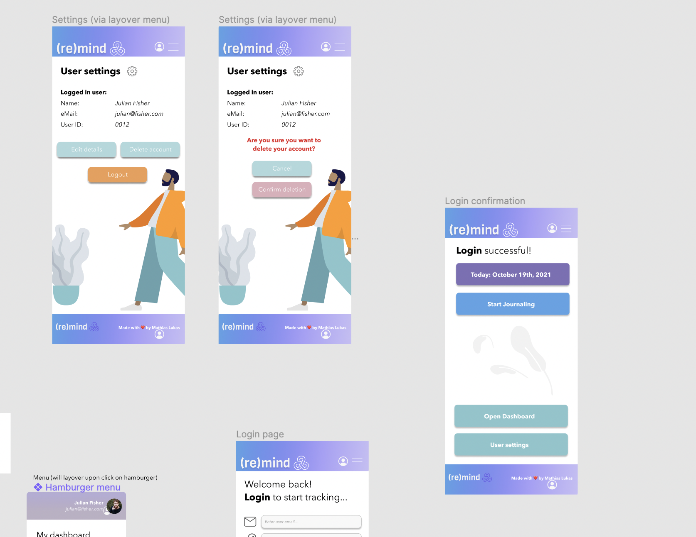

# (re)mind - Mindfulness Tracker

## Deployed version

You can visit the deployed website here: [(re)mind](https://remind-journal.herokuapp.com/)

This web application was created as the final project of the September 2021 cohort at the Upleveled Web Development Bootcamp in Vienna, Austria.

## Vision & Functionalities

(re)mind is a digital version of a mindfulness tracker and daily journaling practice. The vision of (re)mind is to create an easy way to track your daily mood by simply answering a set of (the same) questions every day. The answers are compiled within the user account in so-called tiles on a dashboard.

Through this daily practice, a history of gratitude, achievements and affirmations is collected. This history can be accessed over and over again, strengthening the practice. This can give the user a sense of accomplishment, boost the good feeling about oneself, and the opportunity to come back regularly to review better days when feelings are on a low point.

## Functionalities

- User authentication (registration + login)
- User authorization (only the owner of the items is allowed to create tiles and answer questions)
- Quote of the day
- User can access the tiles on a single page

## Technologies used

- Next.js
- React.js
- PostgreSQL
- Emotion
- TypeScript
- Deployed on Heroku

## Project Management

- Database schema created with DrawSQL: [See schema](https://drawsql.app/final-project/diagrams/final-project#)

- Task management with Github Projects & Notion
- Wireframing and design with Figma

